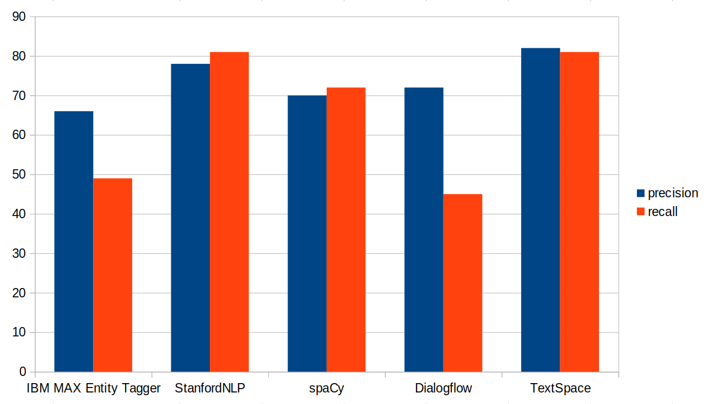

# Benchmarking Named Entity Recognition: StanfordNLP, IBM, spaCy, Dialogflow, and TextSpace

We compare how NeuralSpace's solution [TextSpace](https://neuralspace.ai/textspace/) performs compared to the well-known solutions below. Read the blog post [here](https://medium.com/neuralspace/benchmarking-named-entity-recognition-stanfordnlp-ibm-spacy-dialogflow-and-textspace-af6615eb7930).

- spaCy: https://spacy.io/usage/linguistic-features#named-entities
- IBM's MAX Named Entity Tagger: http://max-named-entity-tagger.max.us-south.containers.appdomain.cloud/
- StanfordNLP: http://corenlp.run/
- Dialogflow: https://dialogflow.com/
- TextSpace: https://ns-demo.azurewebsites.net/

## Results

